# amoeba recipes: 在Minecraft中新增更多配方的資料包

一個基於原版的Minecraft合成配方擴充資料包，讓你的Minecraft玩起來更方便有趣！

## 遊戲版本

Minecraft Java Edition `1.14 - 1.19`

## 安裝

從 [Release](../../releases) 下載後將 `amoeba_recipes.zip` 壓縮檔放到 `.minecraft\saves\<世界名稱>\datapacks\` 路徑中，  
進入該世界後以管理員身分輸入指令 `/datapack enable "file/amoeba_recipes.zip"` 即可。

## 說明

此資料包是以原版能實現的前提下新增的配方，目的是為了提升遊戲的便利性，並確保不會發生原版做不到，裝了資料包卻能夠做到的狀況。

- ✅允許的配方：
  ```
  原木*2 → 木棍*16 (精簡"原木合成木材"、"木材合成木棍"的流程)
  黏土塊*1 → 黏土*4 (以任何物品挖掘黏土塊必定掉落黏土*4)
  西瓜方塊*1 → 西瓜片*3 (挖掘西瓜方塊至少掉落西瓜片*3)
  ```
- ❌拒絕的配方：
  ```
  鵝卵石半磚*2 → 鵝卵石*1 (原版的鵝卵石半磚無法做成鵝卵石)
  雪塊*1 → 雪球*4 (雪塊必須以鏟子挖掘才會掉落雪球)
  西瓜方塊*1 → 西瓜片*9 (挖掘西瓜方塊並非必定掉落西瓜片*9)
  ```

## 新增配方

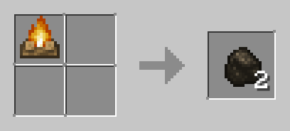 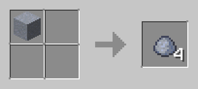

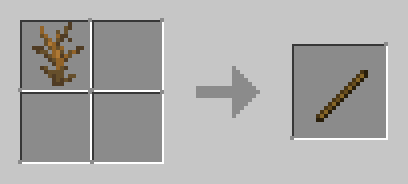 

 

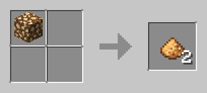 

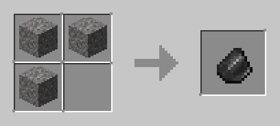 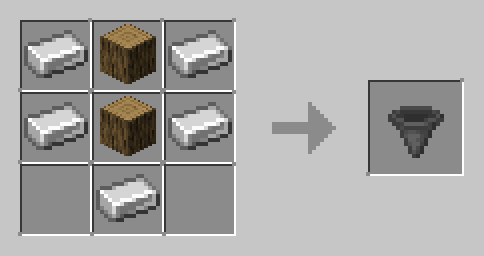

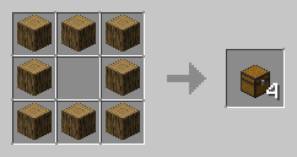 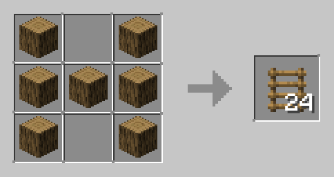

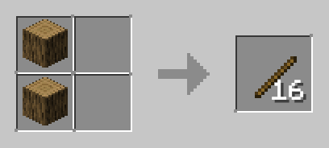 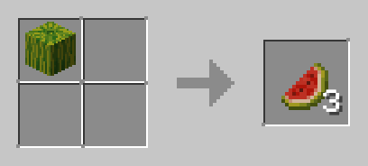

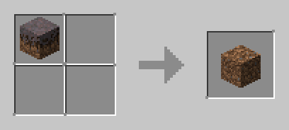 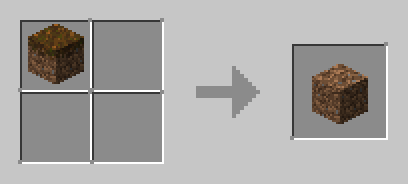

 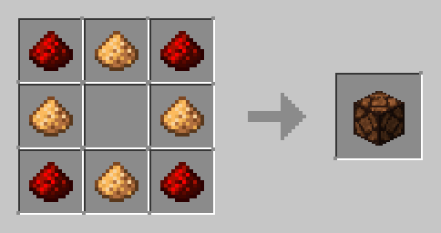

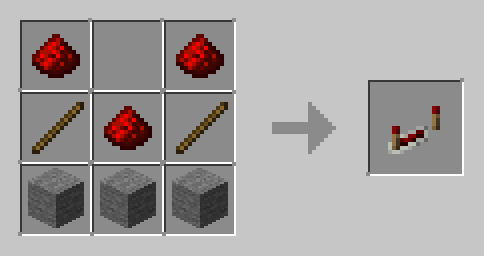 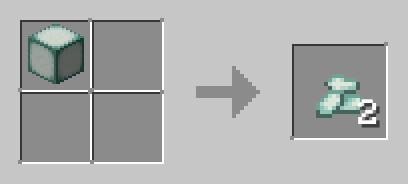

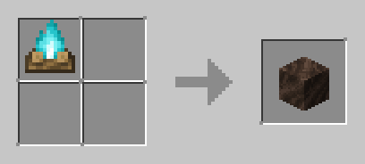

<style>
  img {
    width: 250px
  }
</style>