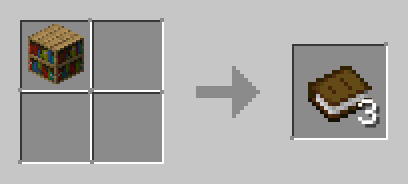

# Amoeba Recipes：在 Minecraft 中新增更多配方的資料包

一個基於原版的 Minecraft 合成配方擴充資料包，讓你的 Minecraft 玩起來更方便有趣！

## 遊戲版本

Minecraft Java Edition `1.14 - 1.20`

## 安裝

從 [Releases](../../releases) 下載後將 `amoeba_recipes.zip` 壓縮檔放到 `.minecraft\saves\<世界名稱>\datapacks` 路徑中，  
進入該世界後以管理員身分輸入指令 `/datapack enable "file/amoeba_recipes.zip"` 即可。

## 說明

此資料包是以原版能實現的前提下新增的配方，目的是為了提升遊戲的便利性，並確保不會發生原版做不到，裝了資料包卻能夠做到的狀況。

- ✅允許的配方：
  ```
  原木×2 → 木棍×16（精簡「原木合成木材」、「木材合成木棒」的流程）
  黏土方塊×1 → 黏土球×4（以任何物品挖掘黏土塊必定掉落黏土球×4）
  西瓜方塊×1 → 西瓜片×3（挖掘西瓜方塊至少掉落西瓜片×3）
  ```
- ❌拒絕的配方：
  ```
  鵝卵石半磚×2 → 鵝卵石×1（原版的鵝卵石半磚無法做成鵝卵石）
  雪塊×1 → 雪球×4（雪塊必須以鏟子挖掘才會掉落雪球）
  西瓜方塊×1 → 西瓜片×9（挖掘西瓜方塊並非必定掉落西瓜片×9）
  ```
## 新增配方



